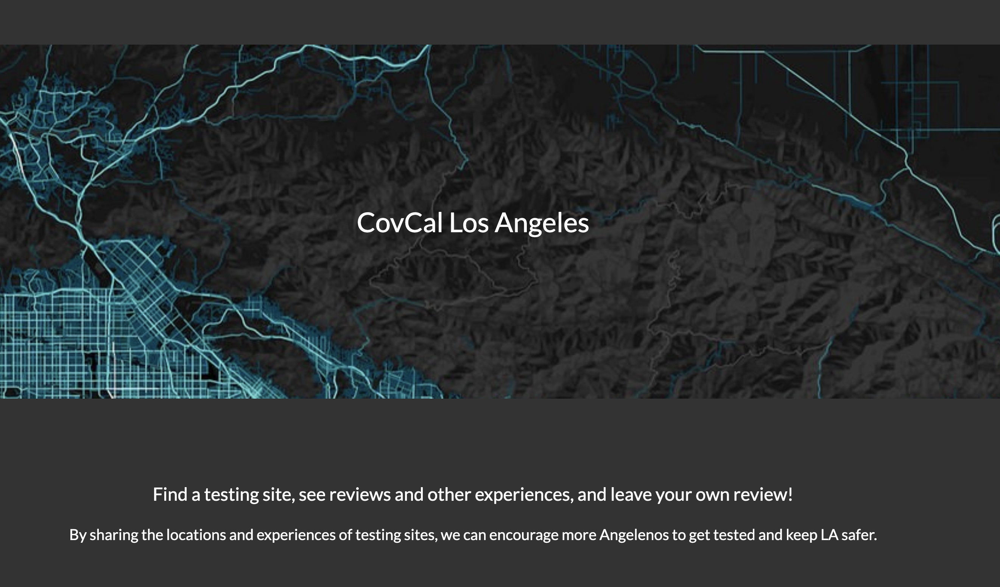
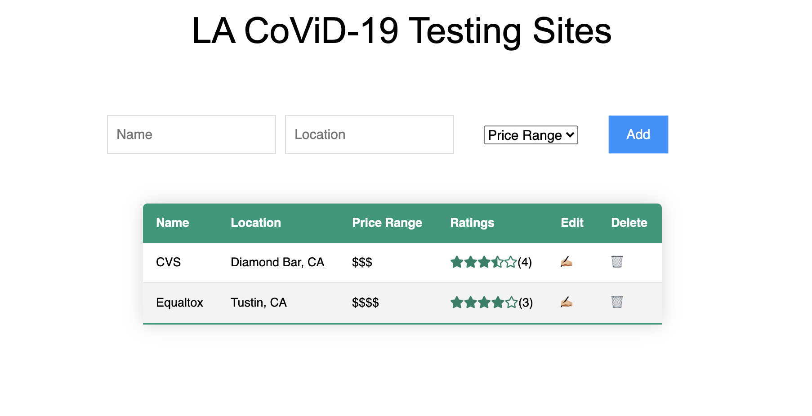
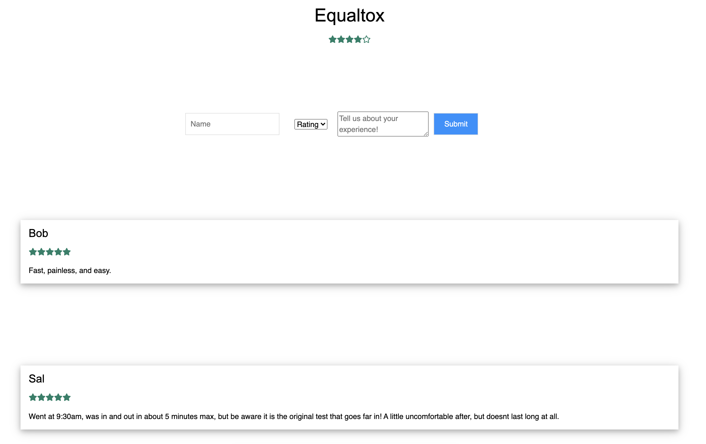

# CovCal App

## App Overview
As LA County coronavirus cases surge, many people want to get tested before/after engaging in outdoor activites before getting to their families, but based on all the confusion on the news, they don't know which testing site is good or what the experience is like. For that reason, people don't go to get tested, and take that risk. This is an app for Coronavirus Testing Sites in the Los Angeles area, where the app will detail all of the above information. Users will be able to use the app to find out where the testing site is, submit/check out reviews and experience details, as well as pricing information.

## Live App
http://covcal-la.herokuapp.com/

## Screenshots of App

## API Endpoints

### Get all sites
Request
GET /sites

### Get a site by ID
Request
GET /sites/:id

### Create a new site
Request
POST /sites

### Delete a site by ID
Request
DELETE /sites/:id

### Update a site by ID
Request
PUT /sites/:id

### Add a review to a site by ID
Request
POST /sites/:id/addReview

## Technologies Used
HTML, CSS, React, Express, Node, PostgreSQL
